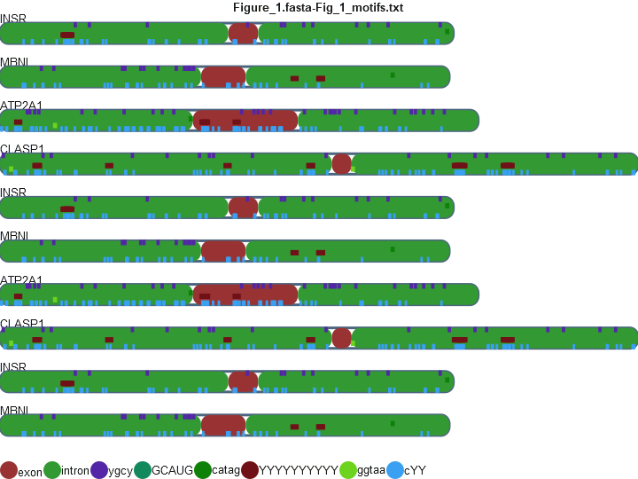

# motif-mark

## Background

Motif mark will take a fasta file with genes and a text file with motifs (IUPAC notation), and will output a PNG file that contains a visual with identified motifs on each gene. The title will contain the fasta file and motif file in the format: `FASTA_FILE-MOTIF_FILE`. Introns are in green, exons on red, and the motifs will each be assigned a random color. At the bottom is a legend with color keys and labels.

Example output below:



NOTE: currently one 1 fasta file and 1 motif file can be accepted at a time.

## Setup

### Anaconda

```bash
conda env create -f environment.yml
```

```bash
conda activate cairo
```

## Usage

```bash
python motif-mark-oop.py -h
```

```
usage: motif-mark-oop.py [-h] -f FASTA -m MOTIFS

This program finds motifs and plots them.

options:
  -h, --help            show this help message and exit
  -f FASTA, --fasta-file FASTA
                        fasta file
  -m MOTIFS, --motifs-file MOTIFS
                        motifs file
```

